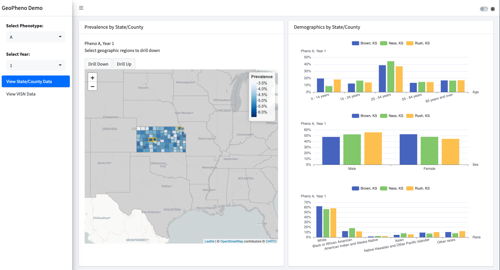

<!-- README.md is generated from README.Rmd. Please edit that file -->

```{r, include = FALSE}
knitr::opts_chunk$set(
  collapse = TRUE,
  comment = "#>",
  fig.path = "man/figures/README-",
  out.width = "100%"
)
```

# GeoPheno

Geospatial Visualization of Phenotypes

<!-- badges: start -->
[](https://lifecycle.r-lib.org/articles/stages.html#experimental)
<!-- badges: end -->

## Installation

You can install the development version of geopheno from [GitHub](https://github.com/) with:

``` r
# install.packages("devtools")
devtools::install_github("celehs/geopheno")
```

## Example

This is a basic example to launch the demo app:

```{r example, eval=FALSE}
geopheno::run_app()
```


