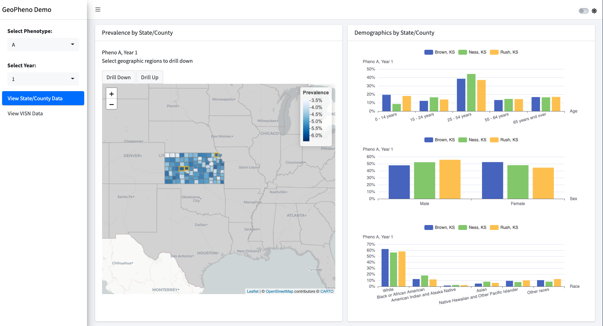

<!-- README.md is generated from README.Rmd. Please edit that file -->

# GeoPheno

Geospatial Visualization of Phenotypes

<!-- badges: start -->

[](https://lifecycle.r-lib.org/articles/stages.html#experimental)
<!-- badges: end -->

NOTE: This package is still under development.

## Installation

You can install the development version of geopheno from
[GitHub](https://github.com/) with:

``` r
# install.packages("devtools")
devtools::install_github("celehs/geopheno")
```

## Example

This is a basic example to launch the demo app:

``` r
geopheno::run_app()
```

 This demo uses simulated data from the
`inst/data-raw/` folder. The `geographic.rds` file contains boundaries
for US states and counties. To visualize real data, you need to replace
the `demographic.rds` file with your own data and follow the same data
format.
